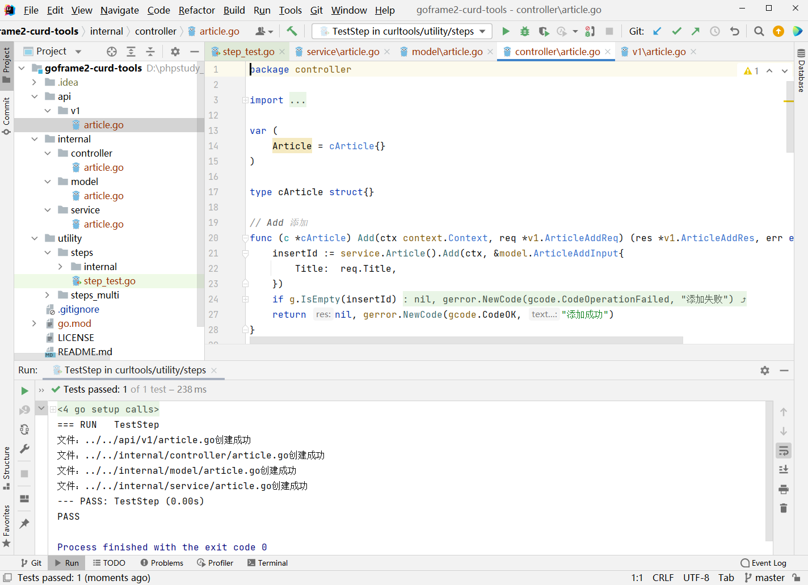
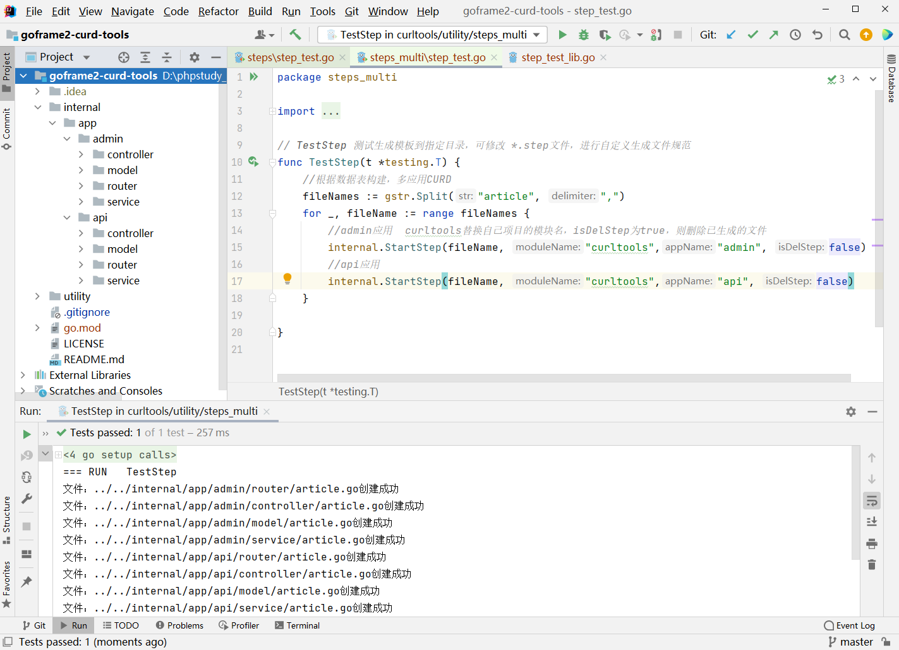

# goframe2单应用、多应用curd生成工具

#### 介绍
1. 基于goframe2实现的goframe2单应用、多应用curd生成工具

#### 安装教程
1. 将 utility 目录下的 steps 和 steps_multi 目录，拷贝到自己的goframe2项目下的utility目录中
2. 将 utility/steps/step_test.go 和 utility/steps_multi/step_test.go 文件中的 "curdtools" 替换成自己的模块名
3. 【单应用】执行 utility/steps/step_test.go 中的 TestStep 方法，生成的文件和目录结构如下
 
4. 【多应用】执行 utility/steps_multi/step_test.go 中的 TestStep 方法，生成的文件和目录结构如下


#### 使用说明

1. 可根据实际项目修改 utility/steps（或steps_multi）/internal 目录下的 **.step文件，进行自定义生成模板
2. 文件模板的变量有 #VAR_NAME# 、#MOUDLE_NAME# 、#ROUTE_NAME#、#APP_NAME#，分别代表 内部实例名称、项目模块名称、路由前缀名称、应用名称

#### 多应用路由配置示例
```go
package cmd

import (
	"context"
	//管理端
	admin "curdtools/internal/app/admin/controller"
	//接口端
	api "curdtools/internal/app/api/controller"
	"github.com/gogf/gf/v2/frame/g"
	"github.com/gogf/gf/v2/net/ghttp"
	"github.com/gogf/gf/v2/os/gcmd"
)

var (
	Main = gcmd.Command{
		Name:  "main",
		Usage: "main",
		Brief: "start http server",
		Func: func(ctx context.Context, parser *gcmd.Parser) (err error) {
			s := g.Server()

			//管理端
			s.Group("/admin", func(group *ghttp.RouterGroup) {
				group.Middleware(ghttp.MiddlewareHandlerResponse)
				group.Bind(
					admin.Article,
				)
			})

			//接口端
			s.Group("/api", func(group *ghttp.RouterGroup) {
				group.Middleware(ghttp.MiddlewareHandlerResponse)
				group.Bind(
					api.Article,
				)
			})
			s.Run()
			return nil
		},
	}
)
```

#### 特别感谢
1. GoFrame是一款模块化、高性能、企业级的Go基础开发框架。如果您想使用Golang开发一个业务型项目，无论是小型还是中大型项目，GoFrame是您的不二之选。如果您想开发一个Golang组件库，GoFrame提供开箱即用、丰富强大的基础组件库也能助您的工作事半功倍。

#### goframe官方
1. demo仓库 https://github.com/gogf
2. 框架文档 https://goframe.org/
3. 命名规范 https://goframe.org/pages/viewpage.action?pageId=30738989
4. goframe2脚手架下载 https://github.com/gogf/gf/releases

#### 学习

golang42章经   
http://books.studygolang.com/go42

golang中文网   
https://tour.go-zh.org/basics/2

golang学习手册  
http://books.studygolang.com/ 
 
golang技术栈  
https://golang-tech-stack.com/tutorial/

golang面试题  
https://blog.csdn.net/wudean0910/article/details/121474805

golang单例  
https://bbs.zblogcn.com/thread-105284.html

golang简历下载  
https://landing.zhaopin.com/resume-templates?id=shangwujianyue

goframe2脚手架下载  
https://github.com/gogf/gf/releases

golang-dubbo  
https://dubbo.apache.org/zh/docs3-building/golang-sdk/quickstart/quickstart_triple/

golang 常见的rpc框架    
https://www.haveyb.com/article/2579

goloang消息队列    
https://blog.51cto.com/u_15127637/4192994

Go语言主流优秀开源库合集    
https://kdocs.cn/l/cjTlioIkL0Yy

golang包搜索  
https://go.libhunt.com/search?query=excel


